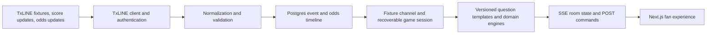

# Palpitei

Palpitei turns official football data into a social prediction game for fans.
During a match, score events and price movements become short questions. Fans
pick an answer, follow what happened on the pitch, earn XP, and compare results
with friends in private leagues.

Built for the **Consumer and Fan Experiences** track of the Superteam World Cup
Hackathon, powered by **TxODDS / TxLINE**.

[Open the production app](https://palpitei-v1-production.up.railway.app)

> Palpitei v1 has no real-money wagering. XP is an in-game score with no
> monetary value.

## Why it exists

Football data products often expose raw feeds, betting terminology, or dense
tables. Palpitei translates the same information into a simple fan loop:

```text
official match event
        ↓
short prediction window
        ↓
the fan makes a pick
        ↓
the next relevant event settles it
        ↓
result, explanation, XP, and room ranking
```

The product is designed for people watching the match, not for professional
traders. The UI says what changed in football language and never requires the
fan to understand an odds feed.

## What judges can try

- Sign in with Google or a Solana wallet through Privy.
- Browse World Cup fixtures supplied by TxLINE.
- Make pre-match picks on an upcoming fixture, editable until kickoff.
- Play a completed match from its real event timeline.
- Enter training mode to replay without affecting XP.
- Create a lobby, copy the invite link, wait for friends, and start together.
- Answer overlapping match questions while the server enforces every deadline.
- Follow match events, statistics, chance movements, and the room ranking.
- Open the final match summary after the replay ends.
- Create or join a private league.
- Earn a trophy balance and browse the marketplace, then open a minted seal and
  its proof screen.

The instant demo login is a zero-friction product tour for evaluation. The
authenticated fixture and replay paths use TxLINE data and server-side game
logic.

## TxLINE integration

TxLINE is the primary sports-data source. The integration is isolated in
`packages/txline` and converts provider payloads into a normalized domain event
contract consumed by the rest of Palpitei.

### Data sources used

| TxLINE source | How Palpitei uses it |
|---|---|
| `/fixtures/snapshot` | World Cup schedule and fixture identity |
| `/scores/updates` | Ordered match timeline, score changes, clock, and match events |
| `/odds/updates` | Time series of full-match 1X2 prices and implied percentages |
| `/scores/snapshot` | Current-state lookup and participant-name recovery |
| `/scores/stat-validation` | Merkle proof for a settled statistic, verified against the on-chain anchor when a seal is minted |
| `/scores/stream` and `/odds/stream` | Live SSE adapter with JWT renewal, reconnection, and `Last-Event-ID` recovery |

The completed England vs Argentina fixture currently used by the replay was
measured and persisted with:

- **962 score events**, with a continuous TxLINE sequence from 2 to 963.
- **3,758 relevant 1X2 price updates**, filtered from 34,971 raw odds
  messages.
- A real final score of **England 1, Argentina 2**.

The replay is not a video and not a scripted mock. The server merges the stored
score and odds series by TxLINE timestamp and runs the same question engine over
that ordered timeline. Large inactive gaps, such as halftime, are compressed,
while event order and match time remain authoritative.

The live adapter accepts multiple active fixtures. It persists each normalized
score/odds message before routing it to groups playing that fixture, while the
demo can continue to use a persisted TxLINE timeline when no match is live.
Active fixtures and the question catalog are persisted; they are not a list of
hardcoded cards in the browser.

The live path ran end-to-end on France vs England on 18 July 2026: real fan
picks, room routing, and a seal minted from the final-whistle sequence with its
proof verified against the devnet anchor. Once a live fixture reads `finished`,
it becomes playable from the Replays tab over the same persisted timeline, so a
live capture turns into a replay without a second ingestion path. The reverse is
blocked by a regression test — a recorded replay can never be promoted to a live
fixture.

### From TxLINE to the fan



### Data-integrity rules

Provider integrations often fail silently, so the code makes the ambiguous
parts explicit:

- `Seq` is checked for gaps because a missing sequence can mean a missing goal,
  card, or clock event.
- TxLINE `MessageId` stays a string. Parsing it as a number can collapse distinct
  price updates.
- Missing `Score` does not mean 0-0, so an absent score block never resets the
  match.
- Empty prices do not become zero-percent chances.
- Parallel `PriceNames`, `Prices`, and `Pct` arrays are validated before mapping.
- Snapshots are not used as timelines. Replay comes from `/updates` series.
- The synthetic event generator is opt-in, development-only, and disabled by
  default.
- Every room displays the provenance of its data.

TxLINE payloads are licensed for the hackathon and are not committed to this
public repository. The real timeline is stored in Postgres.

### Official data and product-derived data

Palpitei does not present every field as if it came directly from TxODDS. The
provenance is explicit:

| Information | Origin |
|---|---|
| Score, match clock, events, and available totals | Official TxLINE data |
| 1X2 prices and supplied percentages | Official TxODDS data |
| Percentage when the provider omits `Pct` | Deterministically derived as `1 / decimal price` |
| Questions, settlement, explanations, and XP | Deterministic Palpitei domain rules |
| Lobby presence, ready state, and room ranking | Palpitei product data |

No LLM generates match facts, predictions, or explanations. If the official
feed does not supply a fact and no documented deterministic rule can derive it,
the UI leaves it absent instead of inventing a value.

## Fair game engine

The browser never decides whether a prediction is correct and never awards XP.
Those decisions are made by the server-side domain engine using the match clock.

- A prediction window closes before the event that can settle it.
- If the settling event arrives while the window is still open, the question is
  voided instead of rewarding players who may already have seen the outcome.
- XP settlement is idempotent per prediction and protected by database
  constraints.
- Every non-training replay run is eligible for XP, including repeated runs.
  Training mode always awards zero XP and writes no predictions.
- Authentication comes from the verified Privy DID. Client-provided user IDs are
  never trusted.

## Pre-match picks

Before kickoff, a fan can pick on an upcoming fixture from the Upcoming tab and
keep editing until the whistle, after which the picks lock for everyone. Four
markets carry their own weights — result 30 XP, exact score 60, goals 25,
corners 25 — and settle at full time from the real score and corner totals.

The market list comes from the TxLINE snapshot, not from a fixed set of cards.
Only fully quoted markets Palpitei can settle are offered; when the feed cannot
back them, the screen says the markets are unavailable instead of showing an
invented line. The goals and corners lines are persisted with each pick and
revalidated against the feed on submission, so a stale client cannot settle
against a line that was never quoted. Settlement is idempotent through a
`settled_at` compare-and-set, and it runs whether or not a room is open.

These picks are graded outside the live question engine, which knows only
`final_result`, `next_goal`, and `hilo_corners`. They have their own table and
their own weights in `packages/core/src/pregame.ts`.

## Seals and trophies

Correct picks earn a trophy balance, tracked in a ledger and shown next to each
fan in the ranking. The marketplace lets a fan browse perks and open a seal — a
minted record of one prediction, with a proof screen describing where the
statistic came from.

Minting runs offline through `npm run selo:mint`, never inside a fan request. The
script reads the real `game_finalised` sequence for the fixture, requests the
Merkle proof from TxLINE, derives the epoch day from the proof timestamp rather
than the wall clock, and verifies the root against the on-chain anchor account on
devnet before writing it into the seal metadata. If any of those steps cannot be
verified, the root is omitted rather than guessed.

## Synchronized rooms

Every invite receives a `partyId`. The key `fixture + mode + partyId` isolates
groups playing the same fixture, so one friend group cannot start or advance
another group's session. A session persists its cursor, engine version and
question-template versions, which lets the server recover the same execution
after a restart instead of creating a new set of questions.

The lobby synchronizes presence, ready state, and host-controlled start through
server-sent events. Match state continues over SSE, while authenticated commands
such as ready, start, and predict use POST requests. This keeps the server as the
single authority for time, questions, score, and XP.

With `REDIS_URL` configured, a Redis lease elects one TxLINE SSE leader and
Redis Pub/Sub distributes normalized, already-persisted events to room channels
on other replicas. Postgres remains the durable source and reconnecting
subscribers reconcile from it. Lobby presence is still process-local, so keep a
single web replica until presence is moved to shared storage; persistence alone
does not make that feature horizontally safe. The trade-off and rollout are
documented in [`docs/realtime-stack.md`](docs/realtime-stack.md).

## Architecture

Palpitei is a TypeScript monorepo with deliberate boundaries between sports
data, domain rules, persistence, and presentation.

| Workspace | Responsibility |
|---|---|
| `apps/web` | Next.js 15 PWA, Privy integration, API routes, SSE rooms, and fan UI |
| `packages/core` | Pure clocks, normalization, questions, settlement, ranking, and explanations |
| `packages/txline` | TxLINE authentication, API client, update sweeps, live SSE, cache adapter, and replay runner |
| `packages/db` | PostgreSQL schema, migrations, repositories, idempotency, persisted timelines, sessions, and templates |
| `packages/ds` | Shared design tokens and UI components |
| `packages/selo` | Seal metadata, badge art, and the devnet mint script that anchors a TxLINE proof |
| `supabase/migrations` | Versioned database migrations |

The core package has no database, network, browser, or framework dependency.
Infrastructure is injected at its boundaries, which makes match rules testable
with a deterministic clock.

## Technology

- TypeScript 5.7
- Next.js 15 and React 19
- Node.js 22.6+
- PostgreSQL on Supabase
- Privy authentication and Solana wallet onboarding
- Server-Sent Events for room state and presence
- Railway with a persistent Node.js runtime
- Node test runner and PGlite for database tests

## Run locally

Requirements: Node.js 22.6 or newer (the tested version is pinned in `.nvmrc`) and a PostgreSQL connection string.

```bash
npm ci
cp .env.example .env
# Fill in Privy, TxLINE, and DATABASE_URL values
npm run db:migrate
npm run dev
```

Open [http://localhost:3000](http://localhost:3000).

For Privy wallet testing on another device, use the local HTTPS server:

```bash
npm run lan:url
npm run dev:https
```

Add the printed HTTPS origin to the Privy allowed origins before testing on a
phone. `localhost` on a phone points to the phone itself, not to the development
machine.

## Verification

```bash
npm run typecheck
npm test
npm run build
```

The current suite contains **363 tests** across the pure domain engine, TxLINE
normalization and ingestion, database behavior, replay timing, room routing,
lobby synchronization, pre-match pick settlement, trophy rules, and the web
application.

## Useful operational commands

```bash
npm run privy:doctor       # inspect Privy and Google OAuth configuration
npm run db:status          # show migration status
npm run cache:match -- ID  # persist an eligible TxLINE match timeline
```

## Deployment

Production runs on Railway with one Node.js replica. Its startup runs the
idempotent migrations before serving traffic, and the health check at
`/api/health` verifies database access, schema migrations, and the expected
database role:

[https://palpitei-v1-production.up.railway.app](https://palpitei-v1-production.up.railway.app)
