# Live game architecture

This document describes the current contract for turning TxLINE events into
synchronized matches. It applies to both replay and live; the difference is
where the timeline comes from and how fast the clock runs. For presence, SSE
transport, and the scale limit of the current delivery, see
[realtime-stack.md](realtime-stack.md).

## Goals and boundaries

- TxLINE is the source of fixtures, score events, and odds; the browser never
  receives raw payloads or provider credentials.
- A TxLINE event is persisted and deduplicated before being published to fans.
- One fixture can serve several groups. Each group has its own game session,
  questions, and picks, kept isolated.
- Questions are determined by the product's versioned engine. The database can
  select parameters and presentation, but it never executes SQL or JavaScript
  supplied by a template.
- With `REDIS_URL`, Redis coordinates ingestion and fan-out across replicas;
  without the variable, the compatible mode remains a single Railway replica.

## Data flow

```mermaid
flowchart LR
  A["TxLINE scores and odds SSE"] --> B["Leader replica via Redis lease"]
  B --> C["Normalization and validation"]
  C --> D["Postgres: idempotent events and odds"]
  D --> P["Redis Pub/Sub: normalized event"]
  P --> E["Local per-fixture channels"]
  E --> F["Game session per fixture + party + mode"]
  F --> G["QuestionEngine and auditable instances"]
  G --> H["Authenticated room SSE"]
```



1. With Redis configured, only the replica holding the 15-second lease opens
   `startLiveIngest`; without Redis, the application keeps the single-replica
   mode. The lease token prevents a lagging replica from renewing or deleting
   another replica's lock.
2. `live_fixtures` determines active fixtures dynamically. The environment list
   (`LIVE_FIXTURE_IDS`, and the legacy `LIVE_FIXTURE_ID`) is only the
   operational bootstrap/fallback; it must not be the only way to add or remove
   a match.
3. The fixture channel serializes persistence and publication. Scores are
   idempotent by `(fixture_id, seq)` and odds by `message_id`.
4. Before the room receives the event, it recovers the persisted timeline and
   drains the buffer of events received during catch-up. The watermark must
   advance while the buffer drains, so the same message is not processed twice.
5. `fixture + partyId + treino` identifies one run. The group gets an active
   session, not an ephemeral room without persisted identity.
6. After the commit, the leader publishes only the normalized event (without
   TxLINE `raw` or `data`) on `palpitei:txline:fixture:<id>`. Each replica
   forwards the event to its local rooms.
7. The room applies the same `processarEvento` used by replay, writes a
   checkpoint, and sends the personalized state to the user over SSE.

## Fixtures and ingestion

The ingester can watch several fixtures simultaneously over a single scores
connection and a single odds connection. Each active fixture gets its own queue
and metrics, but not a dedicated TxLINE connection. This way, a new match does
not require a redeploy to enter routing once it is registered in
`live_fixtures`.

Bootstrap must seed `matches` from the TxLINE snapshot before a session opens. A
missing `start_ts` is an operational error: it makes it impossible to anchor the
clock of a match that has no event yet. If the source fails, the interface must
show unavailability, never an invented match.

For odds displayed in the room, only full-match 1X2 is projected today. Other
markets may be preserved in the database where supported, but they must not feed
`atualizarPct1x2` or generate chance explanations until they have their own UI
and settlement contract.

Pre-match picks read the current snapshot and expose only the markets the
product can validate and settle. The market list is **derived from the TxLINE
snapshot, not a fixed set of cards**: `pregameOdds.ts` includes only fully
quoted markets, the API answers `txlineAvailable: false` with an empty market
list when the feed cannot back them, and the persisted `goals_line` /
`corners_line` are validated against the feed on submission. An empty market
list is a correct answer, not a failure.

## Recoverable sessions

`game_sessions` separates a group's run from the fixture itself. The session
pins:

- `fixture_id`, `party_id`, and the training mode;
- the engine version and the template set chosen at the start;
- a serializable snapshot of the engine/room state;
- the `last_score_seq`, `last_odds_ts`, and `last_odds_message_id` cursors;
- the lifecycle (`active`, `finished`, or `cancelled`).

There is at most one active session for the same combination of fixture, group,
and mode, enforced by a partial unique index. After a restart or deploy, the
server opens the existing session, restores the snapshot, and processes only
events after the cursors. The checkpoint is a recovery optimization; events and
odds in Postgres remain the auditable source for reconstruction and
reconciliation.

On the terminal event, the session is finished, the fixture is marked as closed,
and pre-match pick settlement runs idempotently. Settlement does not depend on
an open room: a match can end with no users connected.

## Template and instance database

`question_templates` is the versioned catalog. Each record holds:

- registered identity and version; a content change creates a new version
  instead of reinterpreting a session already in progress;
- the allowed question type (`final_result`, `next_goal`, or `hilo_corners`);
- eligibility, trigger, resolution, presentation, and scoring policy as
  structured JSON;
- active/retired state.

`questions` remains the auditable instance the fan saw. It references
`session_id`, `template_id`, `template_version`, and `trigger_key`, and stores
the rendered prompt, options, window, and result. Uniqueness per session,
template, and trigger makes redeliveries and restarts idempotent.

The core owns interpretation: each type points to a previously tested handler.
Templates are not a programming language. When a session opens, the active
versions are pinned into the `template_set`; an administrative change does not
alter questions already open, nor change the settlement rule mid-match.

Pre-match picks are graded **outside** this engine. They have their own four
markets and weights in `packages/core/src/pregame.ts` (`PREGAME_XP`: result 30,
exact score 60, goals 25, corners 25) and their own `pregame_picks` table,
precisely because the live engine only knows the three question types above.

## Consistency and fairness

- The engine clock uses feed timestamps; between events it only interpolates.
  Replay accelerates presentation, while live runs at 1x.
- A window still open at the event that would resolve it means voiding, not a
  correct answer.
- A missing `Score` is not 0–0. Partial totals are merged by key.
- The odds `MessageId` is text and must never be converted to a number.
- Terminal events and redeliveries must not pay XP twice; the database applies
  CAS on settlement and idempotency keys prevent duplication. Pre-match picks
  use the same guarantee through a `settled_at` CAS.

## Horizontal scale and remaining limits

With `REDIS_URL`, ingest is no longer duplicated across replicas: Redis elects a
leader, and Pub/Sub fans out to local channels. If a replica loses its
subscription, it reconciles history from Postgres when it returns; Pub/Sub is
fast but ephemeral, so it is never the source of truth. Scores and odds are
idempotent in the database, and the room discards cursors it has already
processed.

Lobby presence/ready is still process-local. Before scaling the web service with
full safety, that store must also move to Redis or a database with broadcast,
and per-session telemetry (lag, gaps, checkpoint, and SSE connections) must be
added. For match operations, keep `numReplicas: 1` until shared presence is
finished; the broker already removes the risk of duplicating the TxLINE
connection and prepares room fan-out.

### Railway configuration

Add Redis to the same environment and set this on the web service:

```env
REDIS_URL=${{Redis.REDIS_URL}}
```

The broker is opt-in. A Redis failure while the variable is present shuts
ingestion down instead of opening one SSE connection per replica; the status
route exposes the broker state.

## Operational verification

```bash
npm run db:migrate
npm run typecheck
npm test
npm run build
```

Before a match, confirm the fixture has been seeded, is active, and has a
`start_ts`; during the match, follow the counters for normalized, persisted, and
published scores/odds; after the final whistle, confirm the session is finished,
the fixture is closed, pre-match picks are settled, and there are no sequence
gaps.

## After full time: a live capture becomes a replay

A fixture ingested live does not stop being useful at the final whistle. Once it
reads `state = 'finished'`, it is playable from the Replays tab over the same
persisted timeline, through the same `processarEvento`. Two rules keep the two
directions from blurring:

- A recorded replay must **never** become a live fixture. `cacheSource`
  separates a timeline swept from `/updates` (`txline-updates`) from one
  captured live (`txline-live`), and there is a dedicated regression test for
  it.
- A replay run gets no `game_session`. Giving it one would make `roomMode()`
  return `finished` — a dead room with no runner — instead of `replay`.

Chronology matters when reading picks across both paths: `predictions.placed_at`
is **match** time, which a replay simulates, while `predictions.created_at` is
wall-clock time. "First" always means `created_at`; using `placed_at` makes a
replay pick look live.

Live captures also carry far more pre-kickoff data than swept ones, because odds
tick for hours before the whistle. Replay therefore advances at a dedicated
pre-game speed until the clock starts, regardless of the requested speed, and
only then honors `REPLAY_SPEED`.

## Historical record: hackathon window of 17–19 July 2026

The first live design targeted France × England (`18257865`) and was later
extended to Spain × Argentina (`18257739`) through `LIVE_FIXTURE_IDS`. The goal
was to prove the TxLINE path before the hackathon deadline, on a single replica.
Per-environment configuration was a quick operational solution, not the
definitive routing model.

France × England ran live on 18 July 2026 and exercised the whole path
end-to-end: streams, persistence, rooms, real fan picks, and a seal minted from
the `game_finalised` sequence with its proof verified against the devnet anchor.
Three measurements from that run are recorded in code because they shaped the
design — the pre-kickoff volume of a live capture (1,248 items, five times the
recorded England × Argentina), the `created_at` versus `placed_at` distinction
above, and the fact that a live fixture reads `finished` the next day and must
be judged by state rather than by "has events".

One thing tried during that window did not survive: reconciling the timeline at
the final whistle was implemented and then reverted, so no backfill runs at full
time. The fixture is closed and rooms are reconciled, but the timeline is not
rewritten.

The fixture, volume, and timing measurements from that window are historical and
must not be read as the current state of the feed.
