# Arquitetura de jogo ao vivo

Este documento descreve o contrato atual para transformar eventos da TxLINE em
partidas sincronizadas. Ele vale para replay e ao vivo; a diferença é a origem
da linha do tempo e a velocidade do relógio. Para presença, transporte SSE e o
limite de escala da entrega atual, consulte [realtime-stack.md](realtime-stack.md).

## Objetivos e fronteiras

- A TxLINE é a fonte de fixtures, eventos de placar e cotações; o navegador não
  recebe payload cru nem credenciais do provedor.
- Um evento TxLINE é persistido e deduplicado antes de ser publicado para fãs.
- Uma mesma fixture pode atender vários grupos. Cada grupo tem sua sessão de
  jogo, perguntas e palpites isolados.
- Perguntas são determinadas pelo motor versionado do produto. O banco pode
  selecionar parâmetros e apresentação, mas nunca executa SQL ou JavaScript
  fornecido por template.
- Com `REDIS_URL`, Redis coordena a ingestão e o fan-out entre réplicas; sem a
  variável, o modo compatível continua sendo uma única réplica Railway.

## Fluxo de dados

```mermaid
flowchart LR
  A["TxLINE scores e odds SSE"] --> B["Réplica líder via lease Redis"]
  B --> C["Normalização e validação"]
  C --> D["Postgres: eventos e odds idempotentes"]
  D --> P["Redis Pub/Sub: evento normalizado"]
  P --> E["Canais locais por fixture"]
  E --> F["Sessão de jogo por fixture + party + modo"]
  F --> G["QuestionEngine e instâncias auditáveis"]
  G --> H["SSE autenticado da sala"]
```



1. Com Redis configurado, apenas a réplica que mantém o lease de 15 segundos
   abre `startLiveIngest`; sem Redis, a aplicação conserva o modo de uma única
   réplica. O token do lease impede que uma réplica atrasada renove ou apague o
   lock de outra.
2. `live_fixtures` determina as fixtures ativas dinamicamente. A lista de
   ambiente (`LIVE_FIXTURE_IDS`, e o legado `LIVE_FIXTURE_ID`) é somente o
   bootstrap/fallback operacional; não deve ser a única forma de adicionar ou
   remover uma partida.
3. O canal da fixture serializa persistência e publicação. Scores são
   idempotentes por `(fixture_id, seq)` e odds por `message_id`.
4. Antes de a sala receber o evento, ela recupera a timeline persistida e drena
   o buffer de eventos recebidos durante o catch-up. O watermark deve avançar
   enquanto o buffer é drenado, para que a mesma mensagem não seja processada
   duas vezes.
5. `fixture + partyId + treino` identifica uma execução. O grupo recebe uma
   sessão ativa, e não uma sala efêmera sem identidade persistida.
6. Depois do commit, a líder publica somente o evento normalizado (sem `raw` ou
   `data` da TxLINE) em `palpitei:txline:fixture:<id>`. Cada réplica encaminha
   o evento às suas salas locais.
7. A sala aplica o mesmo `processarEvento` usado pelo replay, grava um
   checkpoint e envia o estado personalizado ao usuário por SSE.

## Fixtures e ingestão

O ingestor pode observar várias fixtures simultaneamente com uma única conexão
de scores e uma de odds. Cada fixture ativa ganha fila e métricas separadas,
mas não uma conexão TxLINE exclusiva. Assim, uma partida nova não exige
redeploy para entrar no roteamento quando estiver registrada em
`live_fixtures`.

O bootstrap deve semear `matches` a partir do snapshot da TxLINE antes de abrir
uma sessão. A ausência de `start_ts` é erro operacional: impede ancorar o
relógio de uma partida ainda sem evento. Se a fonte falhar, a interface deve
mostrar indisponibilidade, nunca uma partida inventada.

Para odds exibidas na sala, somente o 1X2 de jogo inteiro é projetado hoje. Os
demais mercados podem ser preservados no banco quando suportados, mas não devem
alimentar `atualizarPct1x2` nem gerar explicações de chances até terem contrato
de UI e liquidação próprios. Pré-palpites consultam o snapshot atual e expõem
apenas mercados que o produto consegue validar e liquidar.

## Sessões recuperáveis

`game_sessions` separa a execução de um grupo da fixture em si. A sessão fixa:

- `fixture_id`, `party_id` e modo de treino;
- versão do motor e o conjunto de templates escolhido no início;
- snapshot serializável do estado do motor/sala;
- cursores `last_score_seq`, `last_odds_ts` e `last_odds_message_id`;
- ciclo de vida (`active`, `finished` ou `cancelled`).

Há no máximo uma sessão ativa para a mesma combinação de fixture, grupo e modo.
Após restart ou deploy, o servidor abre a sessão existente, restaura o snapshot
e processa somente os eventos posteriores aos cursores. O checkpoint é uma
otimização de recuperação; eventos e odds no Postgres continuam sendo a fonte
auditável para reconstrução e reconciliação.

Ao receber o evento terminal, a sessão é finalizada, a fixture é marcada como
encerrada e a liquidação de pré-palpites é executada de forma idempotente. A
liquidação não depende de haver uma sala aberta: uma partida pode terminar sem
usuários conectados.

## Banco de templates e instâncias

`question_templates` é o catálogo versionado. Cada registro contém:

- identidade e versão registrada; uma alteração de conteúdo cria nova versão
  em vez de reinterpretar uma sessão em andamento;
- tipo de pergunta permitido (`final_result`, `next_goal` ou `hilo_corners`);
- elegibilidade, gatilho, resolução, apresentação e política de pontuação em
  JSON estruturado;
- estado ativo/aposentado.

`questions` continua sendo a instância auditável que o fã viu. Ela referencia
`session_id`, `template_id`, `template_version` e `trigger_key`, além de guardar
prompt, opções, janela e resultado renderizados. A unicidade por sessão,
template e gatilho torna reentregas ou reinícios idempotentes.

O core mantém a interpretação: cada tipo aponta para um handler previamente
testado. Templates não são uma linguagem de programação. Ao abrir uma sessão,
as versões ativas são fixadas no `template_set`; uma mudança administrativa não
altera perguntas já abertas nem muda a regra de liquidação no meio da partida.

## Consistência e justiça

- O relógio do motor usa timestamps do feed; entre eventos ele apenas interpola.
  Replay acelera a apresentação, enquanto live opera a 1x.
- Janela aberta no evento que a resolveria significa anulação, não acerto.
- `Score` ausente não é 0–0. Totais parciais são mesclados por chave.
- `MessageId` de odds é texto e nunca deve ser convertido em número.
- Eventos terminal e reentregas não podem pagar XP duas vezes; o banco aplica
  CAS na liquidação e as chaves idempotentes impedem duplicação.

## Escala horizontal e limites remanescentes

Com `REDIS_URL`, o ingest não é mais duplicado entre réplicas: Redis elege uma
líder, e Pub/Sub faz o fan-out para os canais locais. Se uma réplica perder a
assinatura, ela reconcilia o histórico pelo Postgres ao voltar; Pub/Sub é rápido
mas efêmero, portanto nunca é a fonte de verdade. Scores e odds são
idempotentes no banco e a sala descarta cursores já processados.

A presença/pronto do lobby ainda é process-local. Antes de escalar o serviço
web com segurança completa, essa store também deve migrar para Redis ou banco
com broadcast, e deve ser adicionada telemetria por sessão (lag, gaps,
checkpoint e conexões SSE). Para a operação de jogo, mantenha `numReplicas: 1`
até a presença compartilhada ser concluída; o broker já elimina o risco de
duplicar a conexão TxLINE e prepara o fan-out das salas.

### Configuração Railway

Adicione Redis ao mesmo ambiente e configure no serviço web:

```env
REDIS_URL=${{Redis.REDIS_URL}}
```

O broker é opt-in. Falha de Redis com a variável presente fecha a ingestão em
vez de abrir um SSE por réplica; a rota de status expõe o estado do broker.

## Verificação operacional

```bash
npm run db:migrate
npm run typecheck
npm test
npm run build
```

Antes de uma partida, confirme que a fixture foi semeada, está ativa e tem
`start_ts`; durante ela, acompanhe contadores de scores/odds normalizados,
persistidos e publicados; após o apito, confirme a sessão finalizada, a fixture
encerrada, a liquidação de pré-palpites e a ausência de gaps de sequência.

## Registro histórico: janela do hackathon de 17–19/07/2026

O primeiro desenho live foi feito para France × England (`18257865`) e depois
ampliado para Spain × Argentina (`18257739`) via `LIVE_FIXTURE_IDS`. Naquele
momento o objetivo era provar o caminho TxLINE antes do prazo do hackathon, em
uma única réplica. Os streams e o fluxo de persistência foram exercitados contra
a devnet; a configuração por ambiente era uma solução de operação rápida, não o
modelo definitivo de roteamento. As medições de fixtures, volumes e horários
daquela janela são históricas e não devem ser usadas como estado atual do feed.
